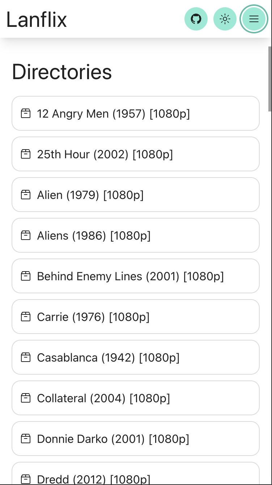
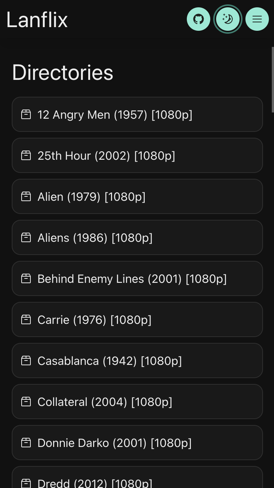
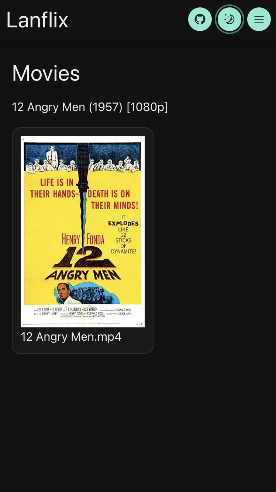

# Lanflix

A full-stack video streaming app that is designed to run inside a docker container on a home server. Just run the setup, add the environment files, install nginx as a reverse proxy on your home server and you can now stream your movies from your home server to any device connected to the network.

## Screenshots (mobile)

### Directories found within your provided root directory:

<br/>

### Directories dark mode:

<br/>

### Movies:


## To get started execute the following command:

```bash
yarn run setup
```

## Support

Currently only supports `.mp4` format.

## Config files

- Create a `.env` file with the following vars:
  - `MEDIA_DIRECTORY`: The root directory where your movies are located on your machine.
- Create a `server/.env` file with the following vars:
  - `CORS_ORIGIN`: `http://<MACHINE_IP>`
  - `OMDB_API_KEY` (optional): Gathers poster data if one does not exist for the current movie in the current directory. An image with the same name of the movie will be written to that directory and used by the client when displaying the poster. You can apply for an API key here: https://www.omdbapi.com/.
- Create a `client/.env.production` file with the following vars:
  - `REACT_APP_API_URL`: `http://<MACHINE_IP>:3001`
- A `client/.env.development` file can be created if you are working locally.

# Start the app (requires Docker)

```bash
yarn run docker-up
```

## TODO
- [x] document adding `env.<>` files to the README
- [x] better management of installed packages for docker cache layer (so that `yarn install` doesn't install all the packages again)
- [x] i18n
- [ ] support subtitles
- [x] better support for mobile (with hamburger menu) (wip - lots to add)
- [ ] editable directories and files
- [x] spellcheck (cspell)
- [ ] add support for additional formats
